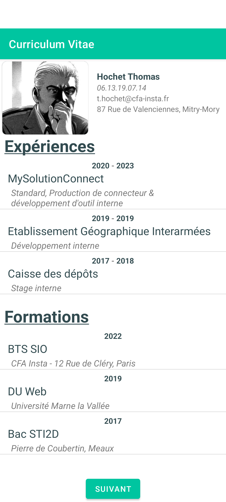
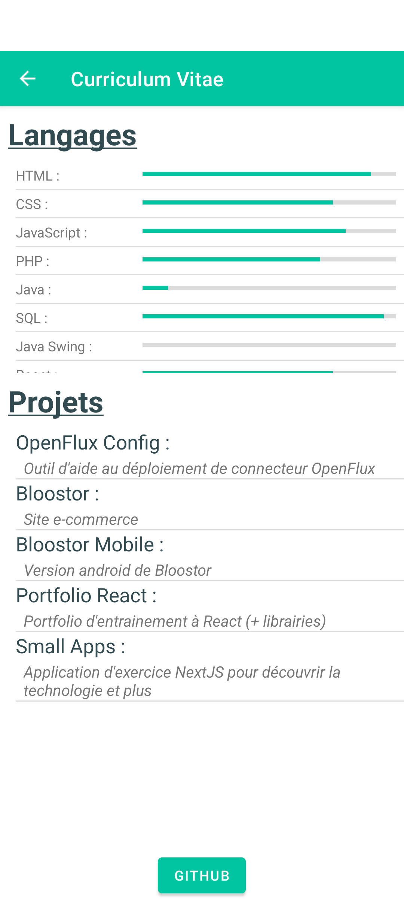

# CV Android

## Réalisation d'un CV statique via Android
Premier exercice avec Android : 
- Manipulation des LinearLayout
- Découverte des _items_ permettant de créer des éléments UI réutilisables
- Premier Adapter personnalisé

